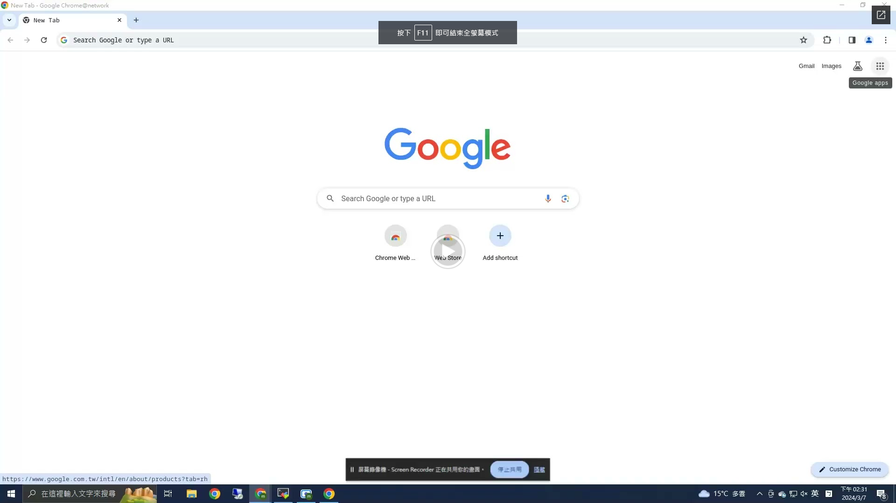
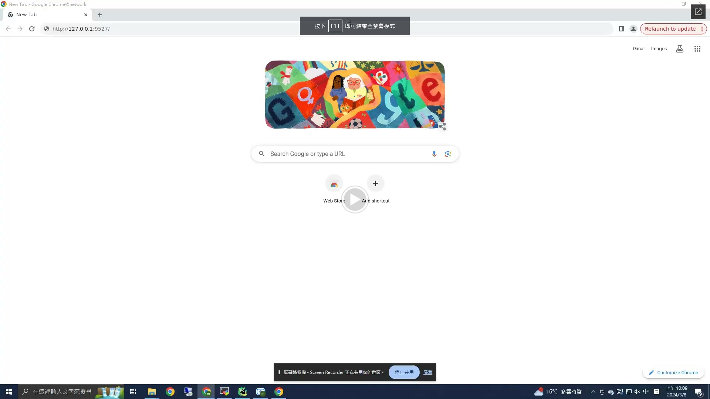

# Record Web Page Plus
___
## Environment Install and Run Server
| [Windows](README.windows.md)(10/11) | [Linux](README.linux.md)(20.04/22.04) |
|:-----------------------------------:|:-------------------------------------:|
## UI Interface from [record-web-page-plus-ui](https://github.com/BearMan-Chen/record-web-page-plus-ui)
## Introduction
> ### Based On [Selenium IDE](https://github.com/seleniumhq/selenium-ide)
> ### Running multiple test suite at once
> ### Flexible script sequence
> ### Full report and video
> ### Better running speed
> ### Variables can be changed without rewriting scripts

## How to use
> 1. Use Selenium IDE to record web page ([Selenium IDE Teach](https://ithelp.ithome.com.tw/articles/10230427))
>    #### Simple Record Selenium
>    
> 2. Save and download Selenium IDE script file `*.side`
> 3. Open http://127.0.0.1:9527 UI and log in (admin/111111)
> 4. Go to [Side Script Management](http://127.0.0.1:9527/#/selenium-ide/side-script-management) page and upload `*.side`
> 5. Go to [Edit Test Plan](http://127.0.0.1:9527/#/selenium-ide/edit-test-plan) page and select test suite and test case
> 6. Go to [Run Web Test](http://127.0.0.1:9527/#/selenium-ide/run-web-test) page and run web test
> 7. Go to [View And Download](http://127.0.0.1:9527/#/selenium-ide/view-and-download) page and view report or video
> 8. [Update Side Script](http://127.0.0.1:9527/#/selenium-ide/update-side-script) page is copy or overwrite test suite and test case to other *.side
>    #### Simple Run Record Web Page Plus
>    

## Future
> 1. Display variables that can be changed from the selected script
> 2. Save multiple custom script list
> 3. Improve the login system
> 4. Run in parallel
> 5. Multi-language