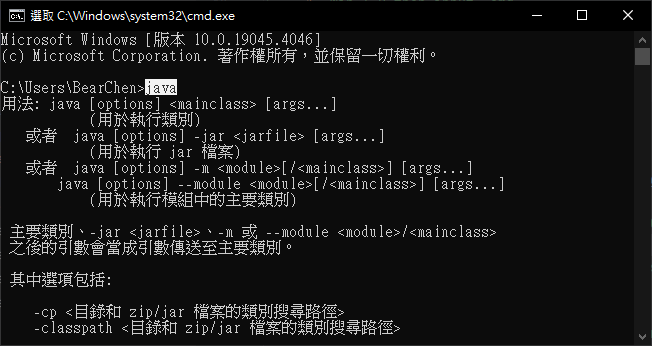
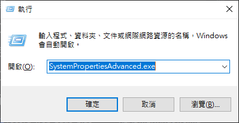

# Windows Environment Install
Windows 10 | Windows 11

## Install Java
> 1. [Download Java for Windows](https://www.java.com/download/ie_manual.jsp?locale=zh_TW)
> 2. Install Java
> 3. Check Java Installed
>    1. Win + R then input `cmd`
>    
>    
>    2. Input `java`
>       ```commandline
>       java
>       ```
>       
___
## Install Allure
> 1. [Download Allure archive](https://github.com/allure-framework/allure2/releases)
>    * Like `allure-*.*.*.zip` (`allure-2.27.0.zip`)
> 2. [Install from an archive (for any system)](https://allurereport.org/docs/gettingstarted-installation/#install-from-an-archive-for-any-system)
> 3. Add the `Allure` folder to `C:\Program Files\`.
> 4. Uncompress the archive into the `C:\Program Files\Allure` directory
> 5. [Add Allure into the Environment Variables](https://blog.csdn.net/lixiaomei0623/article/details/120185069)
>    1. Win + R then input `SystemPropertiesAdvanced.exe`
>    
>    
>    2. Click the Environment Variables button near the bottom-right of the Advanced tab
>    
>    3. In the Environment Variables window (pictured below), highlight the Path variable in the System variables section and click the Edit button.
>    
>    4. Click Add and input the `C:\Program Files\Allure\allure-*.*.*\bin` then click OK
>    
>    5. Check Allure Installed
>       1. Win + R then input `cmd`
>       
>       
>       2. Input `allure`
>          ```commandline
>          allure
>          ```
>          
___
## Install FFmpeg
> 1. [Download FFmpeg](https://github.com/BtbN/FFmpeg-Builds/releases)
>   * Like `ffmpeg-master-latest-win64-gpl.zip`
> 2. Add the `FFmpeg` folder to `C:\Program Files\`.
> 3. Uncompress the archive into the `C:\Program Files\FFmpeg` directory
> 4. [Add FFmpeg into the Environment Variables](https://phoenixnap.com/kb/ffmpeg-windows)
>    1. Win + R then input `SystemPropertiesAdvanced.exe`
>    
>    
>    2. Click the Environment Variables button near the bottom-right of the Advanced tab
>    
>    3. In the Environment Variables window (pictured below), highlight the Path variable in the System variables section and click the Edit button.
>    
>    4. Click Add and input the `C:\Program Files\FFmpeg\ffmpeg-master-latest-win64-gpl\bin` then click OK
>    
>    5. Check FFmpeg Installed
>       1. Win + R then input `cmd`
>       
>       
>       2. Input `ffmpeg`
>          ```commandline
>          ffmpeg
>          ```
>          
___
## Install python packages
1. Into the record-web-page-plus directory
   1. Win + R then input `cmd`
   
   
   2. Into the record-web-page-plus directory by cd
2. (Optional) Use a virtual environment
   1. Install virtual environment
      ```commandline
      pip install virtualenv
      python3 -m venv venv
      venv\Scripts\activate
      ```
3. Use pip to install packages
    ```commandline
    pip install -r .\packages\packages_windows.txt
    ```

## Run Server
1. Into the record-web-page-plus directory
   1. Win + R then input `cmd`
   
   
   2. Into the record-web-page-plus directory by cd
2. command line to run server
   * run server by virtual environment
      ```commandline
      venv\Scripts\python.exe record_web_page_plus_server.py
      ```
   * run server by global environment
      ```commandline
      python.exe record_web_page_plus_server.py
      ```